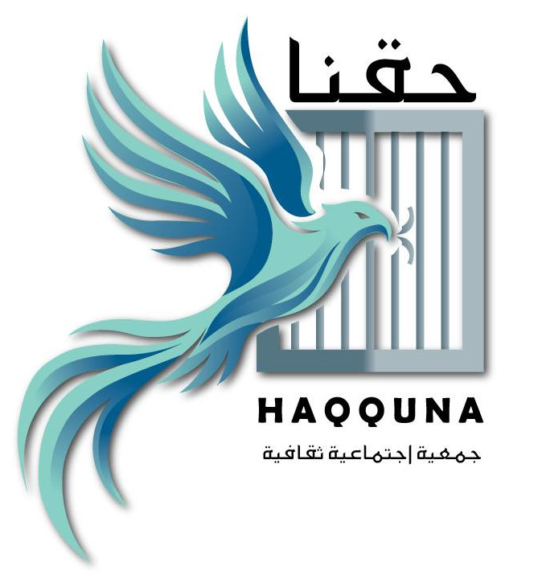

# جمعية حقّنا — HAQQUNA

## نظام توثيق ملفات الناجين والمسح الاجتماعي



نظام Django متكامل لتوثيق ملفات الناجين من الاعتقال السوري وفق المعايير الدولية،
مع نظام مسح اجتماعي شامل للأسرة (الأطفال، التعليم، السكن، العمل، الدخل، الاحتياجات).

---

## المعايير الدولية المعتمدة

النظام مصمم وفق:

1. **بروتوكول إسطنبول المحدّث** (Istanbul Protocol, Rev. 2, 2022) — توثيق التعذيب
2. **بروتوكول بيركلي** (Berkeley Protocol, 2022) — التحقيقات الرقمية مفتوحة المصدر
3. **منهجية الـIIIM** (Annex A, ديسمبر 2024) — الآلية الدولية المحايدة المستقلة لسوريا
4. **دليل Eurojust/ICC** للمجتمع المدني (2022)
5. **بروتوكول مينيسوتا** — للحالات التي تنطوي على وفاة في الاحتجاز

---

## المكوّنات الرئيسية

### 1. تطبيق `accounts` — إدارة المستخدمين والتدقيق
- مستخدم مخصص مع أدوار (موثّق، مشرف، مدقّق، ضابط حماية، مدير، اطلاع فقط)
- تتبع توقيع اتفاقية السرّية وحالة التدريب (إسطنبول/بيركلي)
- سجل تدقيق (`AuditLog`) آلي لكل عملية حساسة على ملفات الناجين

### 2. تطبيق `survivors` — توثيق الناجين
- **`SurvivorProfile`** — الملف الكامل (اسم رباعي، رقم وطني، صور، حالة، تصنيف A/B/C)
- **`InformedConsent`** — الموافقة المستنيرة الطبقية (IIIM/CoI/ICC/إعلام/علني)
- **`DetentionEvent`** — وقائع الاعتقال
- **`DetentionPeriod`** — الخط الزمني للاحتجاز بين الفروع
- **`DetentionFacility`** — مراكز الاحتجاز (27 مركز مسبق التحميل)
- **`TortureMethod`** — أنماط التعذيب (33 نمط بتصنيف بروتوكول إسطنبول)
- **`ReleaseEvent`** — الإفراج
- **`Witness`** — الشهود المتقاطعون (Cross-corroboration)
- **`SupportingDocument`** — الوثائق الداعمة مع **بصمة SHA-256 تلقائية**
- **`ChainOfCustodyLog`** — سلسلة الحيازة
- **`MedicalAssessment`** — التقييم الطبي وفق بروتوكول إسطنبول
- **`LongTermImpact`** — الأثر طويل الأمد

### 3. تطبيق `social_survey` — المسح الاجتماعي
- **`HouseholdSurvey`** — الأسرة (زواج، حجم، تهجير، أيتام)
- **`Child`** — كل ابن/ابنة (تعليم، تسرّب، صحة، عمالة أطفال)
- **`HousingInfo`** — السكن (إيجار، تملّك، مخيم، حالة، مرافق، مصادرة)
- **`EducationStatus`** — تعليم الناجي (قبل/بعد، شهادات مفقودة)
- **`EmploymentInfo`** — العمل والدخل (مصادر، قدرة على العمل)
- **`HealthAccess`** — الوصول الصحي والأمن الغذائي
- **`NeedsAssessment`** — أولويات الاحتياجات (مالية، طبية، قانونية، تعليم...)

### 4. تطبيق `core` — اللوحة الرئيسية
- داشبورد بإحصائيات شاملة
- توزيع الناجين حسب المحافظة والفرع
- متابعة حالة الموافقات المستنيرة
- آخر إجراءات التدقيق

---

## التشغيل

### المتطلبات
```bash
pip install -r requirements.txt
```

### التثبيت الأولي
```bash
python manage.py migrate
python manage.py create_admin              # ينشئ admin / haqquna2026
python manage.py seed_reference_data       # يحمّل مراكز الاحتجاز وأنماط التعذيب
python manage.py runserver
```

### الحساب الأولي
- المستخدم: `admin`
- كلمة المرور: `haqquna2026`
- **بدّل كلمة المرور فور تسجيل الدخول الأول** من `/accounts/profile/`

> لإعادة ضبط كلمة المرور لاحقاً:
> `python manage.py create_admin --password كلمة_جديدة`
>
> أو لإنشاء حساب آخر:
> `python manage.py create_admin --username NAME --password PWD --full-name "اسم كامل"`

---

## الواجهات

### واجهة الموظف (Frontend)
- `/` — الداشبورد
- `/survivors/` — قائمة الناجين والبحث المتقدم
- `/survivors/new/` — إنشاء ملف ناجٍ
- `/survivors/<id>/` — تفاصيل الناجي بكامل العناصر (تبويبات)
- `/social-survey/` — قائمة المسوحات
- `/social-survey/household/<id>/` — تفاصيل المسح
- `/accounts/audit-log/` — سجل التدقيق

### واجهة الإدارة (Admin)
- `/admin/` — لوحة Django Admin بالعربية
- إدخال متعدد المستويات (inline) للأبناء، الفترات، الشهود، الوثائق

---

## ميزات الأمان والتدقيق

- **AuditLog آلي** عبر middleware لكل طلب حساس
- **بصمة SHA-256** آلية لكل وثيقة مرفوعة (Chain of Custody)
- **موافقة طبقية** (يحدد الناجي مع مَن يُسمح بمشاركة ملفه)
- **حق سحب الموافقة** مدمج في النموذج
- **صلاحيات أدوار** مفصّلة (`can_document`, `can_review`, `can_view_sensitive`)
- جلسات تنتهي بعد 4 ساعات
- إغلاق الجلسة عند إغلاق المتصفح
- HttpOnly و Secure cookies (في الإنتاج)

---

## هيكل المشروع

```
hq_protocol/
├── manage.py
├── requirements.txt
├── logo.jpg
├── hq_protocol/          # إعدادات المشروع
│   ├── settings.py       # عربية، RTL، Asia/Damascus، أمان...
│   └── urls.py
├── accounts/             # المستخدمون + AuditLog + Middleware
├── survivors/            # توثيق الناجين (10 نماذج)
│   └── management/commands/seed_reference_data.py
├── social_survey/        # المسح الاجتماعي (7 نماذج)
├── core/                 # الداشبورد
├── templates/            # قوالب Bootstrap 5 RTL بالعربية
│   ├── base.html
│   ├── accounts/
│   ├── survivors/
│   ├── social_survey/
│   └── core/
└── static/
    └── img/logo.jpg
```

---

## التطوير المستقبلي المقترح

- [ ] تصدير ملفات بصيغة PDF (تقرير كامل لكل ناجٍ)
- [ ] تصدير CSV/Excel للمسوحات الاجتماعية
- [ ] تكامل مع KoboToolbox للجمع الميداني
- [ ] خرائط جغرافية لتوزيع الناجين
- [ ] واجهة API (DRF) للتكامل مع منصات أخرى (IIIM, CIJA, SJAC)
- [ ] تشفير قاعدة البيانات على مستوى الحقول الحساسة
- [ ] دعم النسخ الاحتياطي المشفّر التلقائي

---

## الترخيص

© جمعية حقّنا — للاستخدام الداخلي ضمن أنشطة التوثيق والمناصرة.

